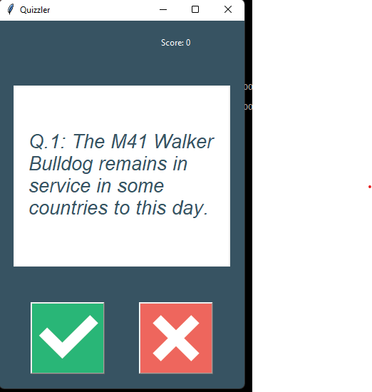

# 🧠 Quizzler - Quiz App

An interactive desktop Quiz Application built with **Python**, **Tkinter**, and the **Open Trivia Database (OpenTDB) API**.

The application fetches True/False trivia questions from an online API, displays them in a clean graphical interface, provides instant feedback on each answer, and keeps track of the player's score throughout the quiz.

---

## 📌 Features

- 🌐 Fetches live quiz questions from the Open Trivia Database API
- 🧠 Displays one question at a time
- ✅ True / False answer buttons
- 📊 Real-time score tracking
- 🎨 Instant visual feedback for correct and incorrect answers
- 🔄 Automatically loads the next question
- 🏁 Detects when the quiz has finished

---

## 📷 Screenshot




---

## 🛠 Built With

- Python 3
- Tkinter
- Requests
- HTML module
- Open Trivia Database API

---

## 📂 Project Structure

```
Quiz-App/
│
├── main.py
├── data.py
├── question_model.py
├── quiz_brain.py
├── ui.py
│
├── images/
│   ├── true.png
│   └── false.png
│
└── README.md
```

---

## 🚀 Getting Started

### Clone the repository

```bash
git clone https://github.com/Atoyebi-410/Python-Quizzler.git
```

### Navigate into the project

```bash
cd Python-Quizzler
```

### Install dependencies

```bash
pip install requests
```

### Run the application

```bash
python main.py
```

---

## 🎮 How It Works

1. The application requests quiz questions from the Open Trivia Database API.
2. A question is displayed in the GUI.
3. Select either **True** or **False**.
4. The application immediately tells you whether your answer is correct.
5. Your score updates automatically.
6. After a short delay, the next question appears.
7. Once all questions have been answered, the quiz ends and the answer buttons are disabled.

---

## 🌐 API Used

This project uses the **Open Trivia Database API (OpenTDB)** to retrieve quiz questions dynamically.

Features of the API include:

- Multiple categories
- Multiple difficulty levels
- Different question types
- Free to use

---

## 💡 What I Learned

This project helped me practice:

- Working with REST APIs
- Making HTTP GET requests using `requests`
- Parsing JSON data
- Object-Oriented Programming
- Creating reusable classes
- Building desktop GUIs with Tkinter
- Updating widgets dynamically
- Using timers with `window.after()`
- Organizing Python applications into multiple modules

---

## 🔮 Planned Improvements

Future versions may include:

- 🎯 Difficulty selection (Easy, Medium, Hard)
- 📚 Quiz category selection
- 🔢 Choose the number of questions
- 🏆 High score tracking
- 📈 Quiz statistics
- ⏸ Pause and resume functionality
- 🌙 Dark mode
- 🔊 Sound effects
- 🌍 Multiple question types (Multiple Choice)
- 💾 Save quiz history

---

## 🏗 Future Refactoring Ideas

Possible improvements to make the project even more robust:

- Handle API connection errors gracefully
- Add a loading screen while fetching questions
- Cache questions when offline
- Move configuration values into a separate settings file
- Improve UI responsiveness
- Add unit tests

---

## 📅 Learning Journey

This project was built as **Day 35** of the **100 Days of Code: The Complete Python Pro Bootcamp** by Dr. Angela Yu.

The goal of this project was to combine GUI development, APIs, object-oriented programming, and application architecture into a complete desktop application.

---

## 🤝 Contributing

Suggestions and improvements are welcome.

Feel free to fork this repository and submit a pull request.

---

## 📜 License

This project is open source and available under the MIT License.

---

## 👨‍💻 Author

**Olanrewaju Ibrahim**

If you found this project helpful, please consider giving it a ⭐ on GitHub.